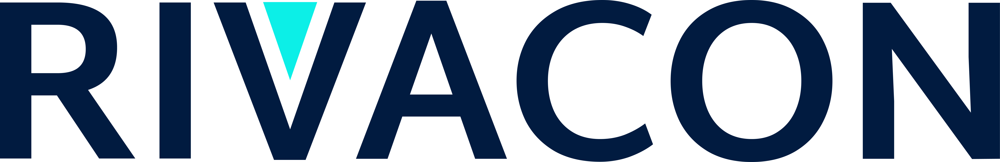

# RiNo :rhinoceros:
The **RI**VACON**No**tebooks (RiNo) repository is a collection of jupyter notebooks.
Each jupyter notebook aims to highlight one specific topic in the fields of quantitative finance or energy markets. Therefore, our notebooks are designed to be self sufficient and contain executable code or plain markdown.

By clicking on the **binder** badge at the top, you can start a safari through our various notebooks. 

Updates and announcements for upcomming notebooks will be posted on our LinkedIn profile, so be sure to [follow us on LinkedIn](https://de.linkedin.com/company/rivacon-gmbh) to stay up to date.

## Table of Contents
### Finance
#### 1. Instruments
* [Repurchase Agreements](notebooks/instruments/repurchase_agreement.ipynb)

#

